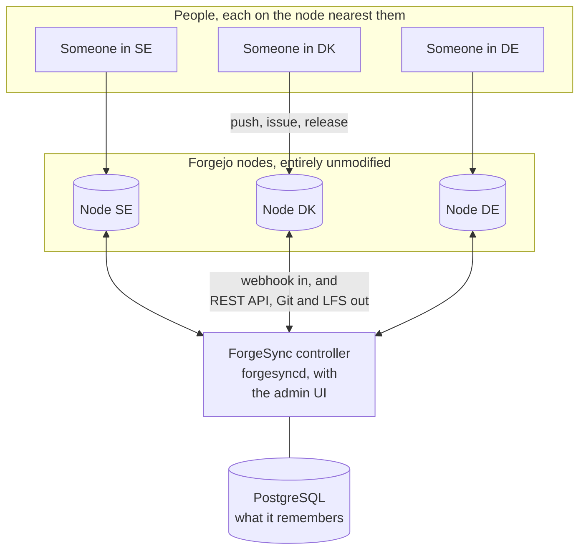
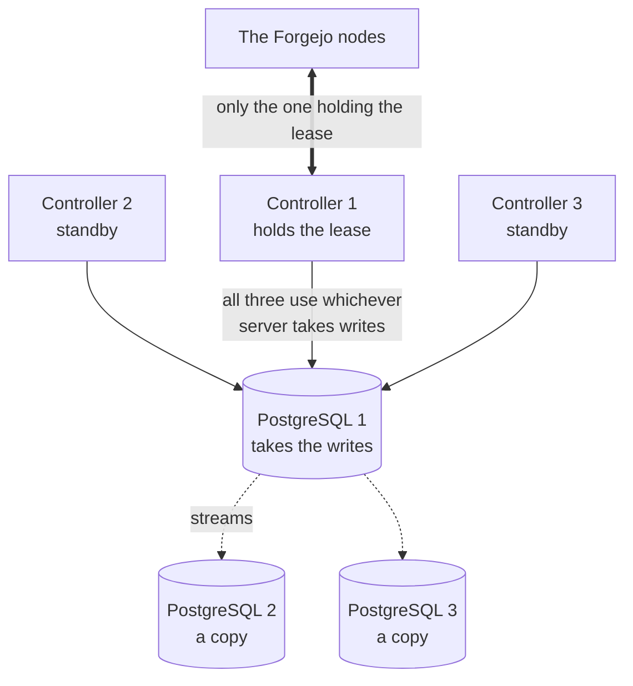

# ForgeSync

[](LICENSE)

ForgeSync keeps several independent, **stock** Forgejo servers in step, so that people can
work on whichever one is nearest and find the same thing there. It is an external control
plane: it never patches Forgejo, never touches its database, and uses only what Forgejo
offers anyone: the REST API, webhooks, the Git and LFS protocols.

It is built around one rule: **never lose work, never decide for the owner.** Only
fast-forwards and creations are pushed, every push is leased against what ForgeSync last
wrote, and anything two people could genuinely disagree about becomes a conflict with both
sides shown rather than a decision made quietly.

## The problem

Several Forgejo servers, in several countries, each one a complete and ordinary Forgejo
that people use directly. Someone in Stockholm pushes to the Swedish one; someone in
Copenhagen opens an issue on the Danish one. Without something in between, those are two
different repositories that happen to share a name.

ForgeSync was started around [SceneGit](https://scenegit.org/), a European alternative git
repository for **sceners**, whose own motto is keeping the scene alive. The scene here is
the demoscene: the people who have been writing demos, intros, trackers and cross-development
tools for the Commodore 64, the Amiga and the PC since the 1980s, and are still doing it.
SceneGit sits alongside the places that scene already keeps its history in, among them
[Scene.org](https://scene.org/), [Demozoo](https://demozoo.org/),
[CSDb](https://csdb.dk/) and [Pouet](https://www.pouet.net/).

That is also where the shape of this problem comes from: several nodes in several countries,
one identity behind them, and people who should be able to push to whichever is nearest
without thinking about it.

Forgejo has no built-in way to do that, and the usual answers each cost something this
project was not willing to pay: one server everybody reaches over a long link, or a patched
Forgejo that stops being upgradable, or mirrors that only travel one way.

## How it works

### The pieces



**The Forgejo nodes are stock.** No patch, no plugin, no git hook, and ForgeSync never reads
or writes their databases. It uses only what any client may use: the REST API, webhooks, the
Git and LFS protocols. Upgrading a node is Forgejo's business, not ForgeSync's.

**The controller** is one process outside them, with the admin UI built into the binary. It
is the only thing that writes to the nodes.

**PostgreSQL** is what the controller remembers: which repositories exist on which nodes,
which node is authoritative for each, what ForgeSync last wrote where, and every difference
it could not settle. It is the one thing to back up.

### Every repository has one primary node

This is the idea the rest follows from. ForgeSync does not try to merge everything from
everywhere. For each repository, one node is **authoritative**, and the others are copies of
it.

Which one is worked out automatically: a person's repositories follow the node where their
account was first created, on the reasoning that this is where they work. Anything else
falls back to wherever the repository appeared first. An administrator can override it at
any time, and that choice is never taken away again.

In the ordinary case that is also where you already are: your own repositories take your own
home node as their primary, so the nearest node and the authoritative one are the same
server. The other nodes hold a copy you can clone, browse and fork.

What happens if something is pushed to one of those copies depends on a setting you choose.
`replication.protect_replicas`, which the production configuration turns on, puts a
ForgeSync-owned protection rule on every replica: Forgejo itself then refuses the push, and
people work on the primary. Worth knowing before you deploy it, because the rejection is
Forgejo's own and says nothing about ForgeSync or about which node to use instead
([docs/LIMITATIONS.md](docs/LIMITATIONS.md) has the detail). Left off, a push to a replica
is handled by what it actually is:

- **It only adds commits, or a branch only that node has.** Nothing is in question, so
  ForgeSync moves it to the primary itself and carries on from there. Nobody is asked.
- **Both sides have moved.** Now there is a real question, and it belongs to the repository's
  owner rather than to ForgeSync. See below.

### Two paths: one fast, one thorough

| | The webhook | The scan round |
|---|---|---|
| When | The moment something changes | Every `inventory.interval` |
| Does | Replicates that one repository | Lists and compares everything, everywhere |
| Costs | Seconds, whatever the repository count | Minutes, growing with repositories times nodes |
| For | What people feel | Catching what a lost delivery missed |

The webhook is the mechanism and the round is the safety net, not the other way round. At a
thousand repositories a settled round takes seventeen minutes while a push still reaches
every node in eleven seconds ([docs/PERFORMANCE.md](docs/PERFORMANCE.md)).

### What happens when you push

1. You push. In the ordinary case that is your nearest node, which is also this
   repository's primary. Nothing about your workflow changes.
2. Forgejo tells ForgeSync that repository changed.
3. If you pushed somewhere other than that repository's primary, ForgeSync first gets the
   primary caught up, provided that loses nothing: your commits are moved there, or your new
   branch is created there. If the primary has moved too, it stops and asks instead.
4. It fetches the commits into a bare cache of its own and pushes them to every other node.
   Only fast-forwards and new refs, and **every push is leased** against exactly what
   ForgeSync last wrote there, so a change made on the far side in the meantime makes the
   push fail instead of overwriting anything.
5. What belongs with the code follows the same way: issues, comments, releases, labels, LFS
   objects, packages and the rest, each by the rule that suits it.

### What happens when it cannot decide

It says so, and stops. A difference two people could genuinely disagree about becomes a
**conflict**, with both sides shown, and nothing is overwritten while it stands.

The one case ForgeSync helps with is the common one. When a branch has diverged, it opens a
pull request on the primary and leaves it to the repository's owner: merge it and both
histories are kept, close it without merging and the owner has chosen the primary's version,
at which point the replicas are reset and their version is kept on a backup branch for a
month. That is the owner deciding, with ForgeSync doing the work.

### Who signs in, and what is kept

Everybody who uses the nodes signs in with **[SceneID](https://id.scene.org/)**, the
scene's own single sign-on, over OIDC. The design requires local sign-up to be off on every
node, leaving only the two local accounts a node cannot run without: its site administrator
and ForgeSync's service account. So **a regular user has no password on any node**, and none on
ForgeSync either. There is nothing of theirs to steal from this infrastructure, and nothing
to reset when they lose it.

That is also what makes the whole thing possible rather than merely tidy. A person's SceneID
subject is the same string on every node, so ForgeSync can say "this is the same person
here and there" without matching on names or email addresses, which drift. What it keeps
about anybody is that subject, the login name, which nodes they have an account on and which
node is their primary. No password, no token, no email address.

**What ForgeSync does hold**, because it would be dishonest to say "no credentials" and
leave it there:

| | |
|---|---|
| Each node's API token | Sealed with AES-256-GCM before it is stored. The key is a file on the controllers and never goes in the database, so a stolen dump is not a stolen node |
| ForgeSync's own administrator accounts | PBKDF2-SHA256 with a per-account salt. These sign in to the *controllers*, not to any node, and no node ever learns they exist |
| Sessions | The SHA-256 of the cookie's value, never the value, so the table cannot be read back into a session |
| The admin token, webhook secret and database URL | Files on disk, `0600`, never in the config and never logged |

Those are an administrator's credentials for the infrastructure, which any control plane
must hold to do anything at all. They are not anybody's personal credentials, and no user
credential passes through ForgeSync at any point.

ForgeSync's own admin UI deliberately does **not** use SceneID. It has its own accounts, for
one reason: being locked out is exactly the moment when SceneID, or a controller, is the
thing that has broken. Those accounts live in the shared database, so one made on either
controller works on both, and there is a break-glass admin token besides.

### Three things called "primary"

Worth separating before reading anything else here:

| Term | Means |
|---|---|
| **Repository primary** | The Forgejo node that is authoritative for one repository |
| **ForgeSync leader** | Whichever controller currently holds the lease and is doing the work |
| **Database primary** | The PostgreSQL server that takes writes |

### One controller, or three

The diagram above draws the controller as one box. It can be one machine, two or three, and
a machine is always the same thing: PostgreSQL, a controller and the git cache. There is no
second kind of server to install.

What does **not** multiply is the database. Controllers share **one** database and take a
lease in it, and that shared row is the whole basis of "one controller acts at a time": if
each had a database of its own there would be no witness, and nothing to stop two of them
working at once. So on three machines there are three PostgreSQL servers but still one
database, of which exactly one copy takes writes while the others stream from it.



Each controller and PostgreSQL pair above is one machine. `database.url` names all three
servers with `target_session_attrs=read-write`, so every controller connects to whichever is
currently taking writes, and a promotion needs nothing changed anywhere. A controller that
finds itself talking to a copy refuses it rather than carrying on: it would answer every
read and look healthy while renewing no lease and replicating nothing.

Whichever controller holds the lease does the work and the rest serve the same pages, ready
to take over. Which one should be acting is configured (`controller.priority`) and can be
changed from the page of the controller you're looking at. Sessions and ForgeSync's own
accounts live in that database too, so a failover doesn't sign anyone out.

One machine is a fine place to start. **Two** gives you a controller that survives losing
the first; the second can also keep a continuously updated copy of the database, which is
worth having on its own, but promotion stays deliberately manual, because two machines
cannot tell "the other one is dead" from "I cannot reach the other one". **Three** is what
lets the database promote itself, for the same reason a Proxmox cluster wants three nodes: a
majority of two is both of them, so a pair cannot decide safely, while a majority of three
is two. A fourth adds nothing to a quorum.
[deploy/prod/README.md](deploy/prod/README.md) section 12 has the counts, where the machines
should sit, and what a failover costs.

## What it keeps the same

Branches and tags, the LFS objects large files are kept in, the wiki, releases and their
files, repository settings and topics, branch protection (plus ForgeSync's own guard on the
replicas), collaborators, organizations with their teams and members, labels, milestones,
issues and comments, pull requests and their conversation, reviews, reactions, attachments,
assignees, Actions variables, generic, maven, nuget, rubygems and helm packages, and forks
as forks. A repository missing on a node is created, with its SceneID owner; one deleted on
its primary is archived on the others rather than deleted; a rename keeps the repository's
identity.

What it deliberately doesn't, and what Forgejo won't let it, is in
[docs/LIMITATIONS.md](docs/LIMITATIONS.md), with the reason for each.

## Where to start

| If you want to | Read |
|---|---|
| Run it for real, natively on Debian | [deploy/prod/README.md](deploy/prod/README.md) |
| Try it, with five Forgejo nodes in Docker | [deploy/test/README.md](deploy/test/README.md) |
| Know what it can't do, and why | [docs/LIMITATIONS.md](docs/LIMITATIONS.md) |
| Know what it costs at 200 and at 1000 repositories | [docs/PERFORMANCE.md](docs/PERFORMANCE.md) |
| Understand the design | [docs/ForgeSync_Solution_Architecture.md](docs/ForgeSync_Solution_Architecture.md) |
| Work on the code | [CONTRIBUTING.md](CONTRIBUTING.md): the commands, the test environment, the conventions |
| Find your way around the source | [docs/CODE_REFERENCE.md](docs/CODE_REFERENCE.md): what each package does, and its entry points |
| Know how it is secured | [SECURITY.md](SECURITY.md), and [docs/SECURITY_REVIEW.md](docs/SECURITY_REVIEW.md) for the last review |

## Building

Go 1.27 and Node 22 (for the admin UI, which is embedded in the controller binary):

```sh
make build        # web UI, then bin/forgesyncd and bin/forgesync
make check        # go vet, gofmt, Go tests, UI type-check and tests
make test-db      # also the tests that need PostgreSQL
```

`bin/forgesyncd` is the controller and its admin UI; `bin/forgesync` is the command-line
client for the same API.

### Before a release

`make check` is the gate for every change. Before tagging one, these slower passes run as
well, with tools that aren't dependencies of the build -- install them where they don't
become one (`GOBIN=/tmp/bin go install ...`):

```sh
golangci-lint run ./...                      # errcheck, govet, ineffassign, staticcheck, unused
govulncheck ./...                            # known vulnerabilities in what we import
gosec -exclude-dir=web ./...                 # security patterns in the Go source
gitleaks dir . --config .gitleaks.toml       # secrets, in the tree and in the history
osv-scanner scan source -r .                 # Go and npm dependencies
shellcheck -S warning $(git ls-files '*.sh') # the setup, probe and deploy scripts
cd web && npm audit                          # and the UI's dependencies
```

`.golangci.yml` and `.gitleaks.toml` say which findings were looked at and deliberately
kept, and why: an error ignored in a test fixture, a write to an `http.ResponseWriter` with
nobody left to tell, the probe-generated usernames a secret scanner reads as keys. Keep
those files honest rather than silencing a tool in passing. `gosec` still
reports five findings by design: the session cookie's `Secure` flag is a setting (it has
to be, for a reverse proxy terminating TLS), the git CLI is run with arguments ForgeSync
builds, and the config and token files are read from paths the config gives.

## Adding a node

Nodes live in ForgeSync's database, so one is added from the admin UI and every controller
has it: there is no list to edit on each machine. ForgeSync asks the node what it is and
refuses to store one it could not reach or could not use, so a mistake fails while somebody
is looking at it. The token is sealed with a key the controllers hold and the database never
sees. What ForgeSync will not do is set the node up: the parts that matter most are
`app.ini` keys no API can reach, so the UI says what the node needs and then checks.

## The scripts

| Script | What it does |
|---|---|
| `deploy/test/setup.sh` | Brings up the whole test environment: Forgejo nodes, SceneID (Keycloak), the database and one, two or three controllers. Safe to re-run. |
| `deploy/test/check-dismissal.sh` | Checks conflict dismissal end to end against a running environment: make a conflict ForgeSync can't settle, dismiss it, watch it stay dismissed, come back when it changes, and clear when it goes. |
| `deploy/test/scale.sh` | `make N` / `drop`: many repositories on one node, for measuring what a round costs. |
| `deploy/prod/install.sh` | Installs ForgeSync on a Debian 13 machine, and joins another to it. |
| `deploy/prod/cluster.sh` | The three-machine database, which promotes itself when a machine is lost. |
| `deploy/prod/backup.sh` | A dump of ForgeSync's database; `--verify` restores it into a scratch database and counts what came back. |
| `phase0/run-all.sh` | The probes that established what stock Forgejo does and doesn't allow (`phase0/README.md`). |

`deploy/prod/prometheus/` has a scrape job and alert rules for the metrics the controller
exposes.

Every script takes `PUBLIC_HOST=<host or IP>` when the environment isn't reachable under the
`*.test` names.

## This release

The first release of ForgeSync was published during **[Mysdata 2026](https://mysdata.org/)**
in Karlskrona, in co-operation with Hagar of TST, a scene group. The repository is
<https://github.com/LandrethX/ForgeSync>.

## Licence

Apache License 2.0; see [LICENSE](LICENSE).

Forgejo itself is separate software under the GPL, version 3 or later, from v9 onward.
ForgeSync neither includes nor links any of it: it is a client that speaks to a Forgejo
server over the REST API, webhooks and the Git and LFS protocols, which is why the two
licences do not meet.
